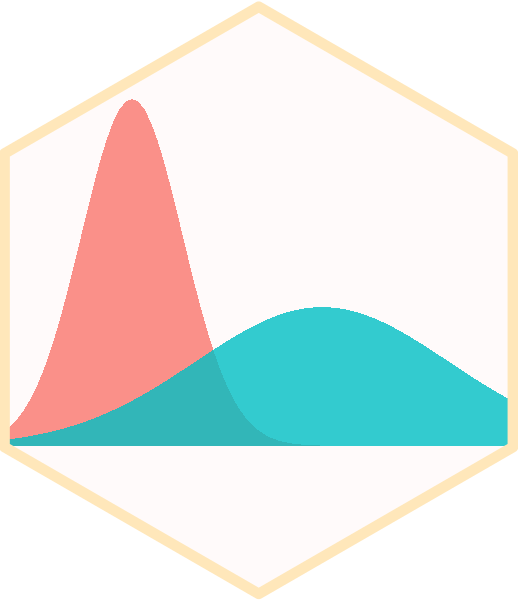
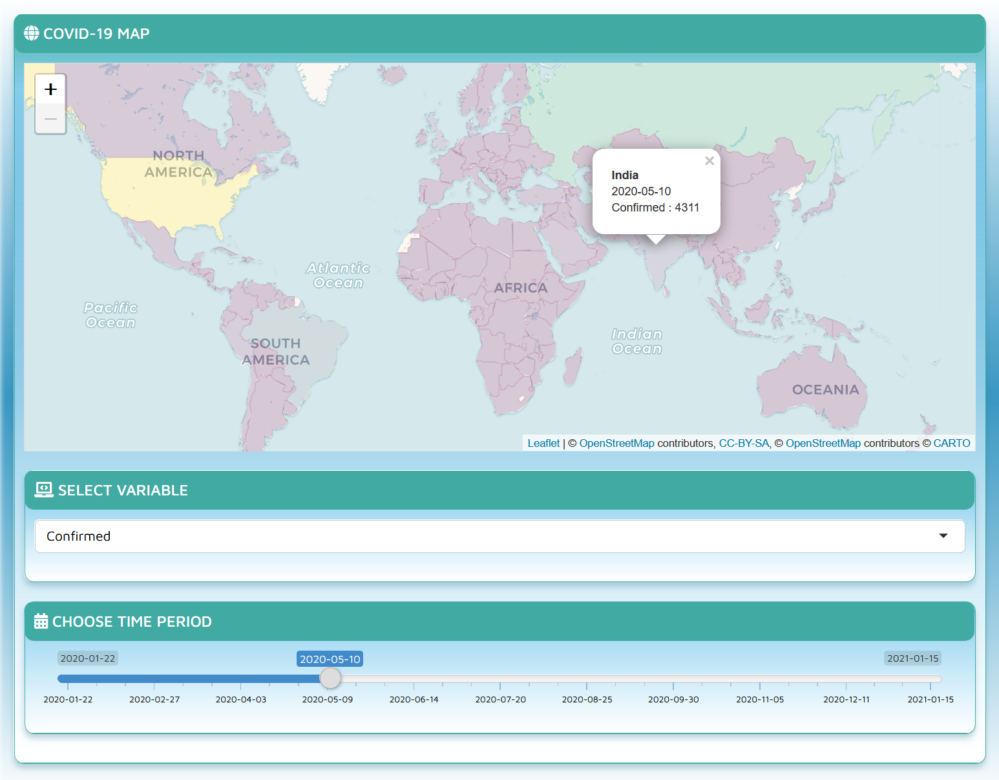
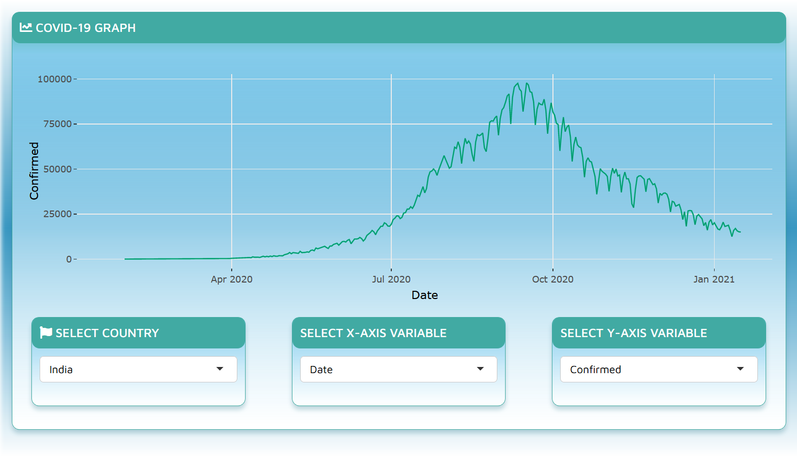

```{r setup, include=FALSE}
knitr::opts_chunk$set(echo = TRUE)
```

# [COVID-19 Tracker](https://chrl3hr5.shinyapps.io/COVID-19_Tracker/) 

A shiny web application for tracking the spread of COVID-19 globally.

<i> The app includes two sections - </i>

<b> Dashboard </b> - It includes a reactive map to visualize various parameters associated with COVID-19 like the number of confirmed cases, number of tests, etc., on a map for a particular date.



<b> Visualization </b> - This section contains reactive graph for visualizing the change in various COVID-19 related parameters against time or against each other.

