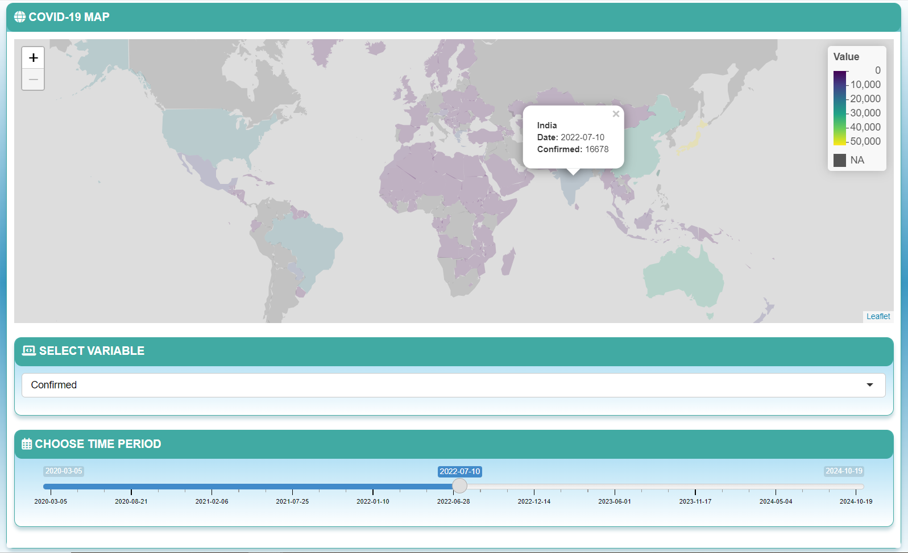
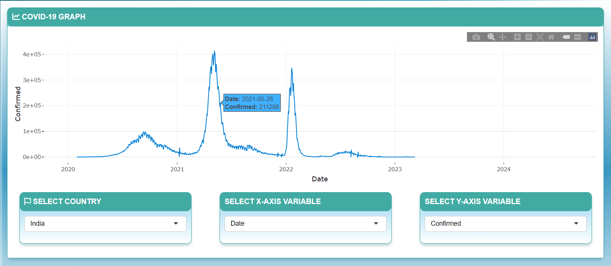

# [COVID-19 Tracker](https://chrl3hr5.shinyapps.io/COVID-19/) 

A shiny web application for tracking the spread of COVID-19 globally.

<i> The app includes two sections - </i>

<b> Dashboard </b> - It includes a reactive map to visualize various
parameters associated with COVID-19 like the number of confirmed cases,
number of tests, etc., on a map for a particular date.

<b> Visualization </b> - This section contains reactive graph for
visualizing the change in various COVID-19 related parameters against
time or against each other.

<b> Data Source </b> - [COVID-19 Data
Hub](https://github.com/covid19datahub/COVID19)   <b> Map Source
</b> - [geoBoundaries](https://github.com/wmgeolab/geoBoundaries)
